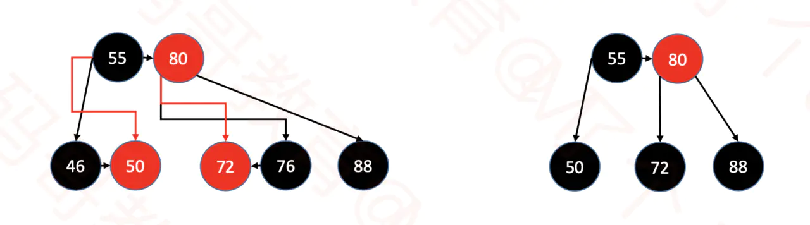
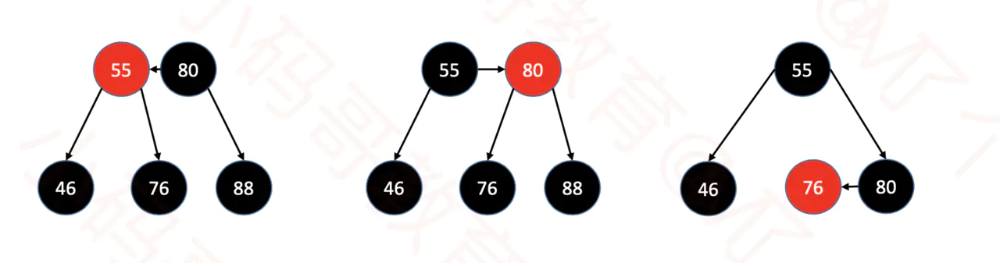
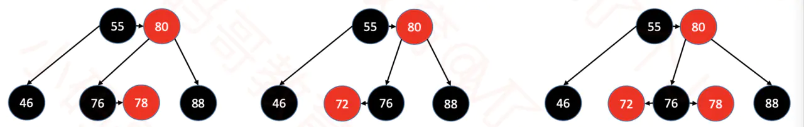
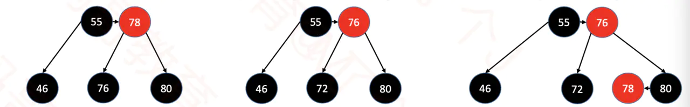
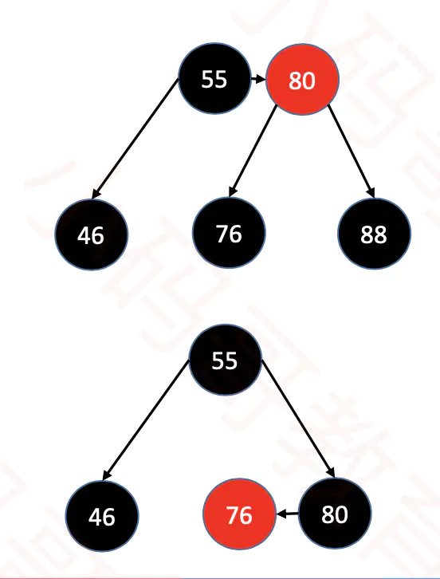

插入操作


删除操作

假设删除的节点定为 node，简称 n

删除度为 2 的节点时，可以选择用后继或前驱节点来替换，我们这里选择用后继节点来替换。

这样的话如果 n 右子不为空，就可以选择用后继节点来替换 n，接下来就可以删除后继结点了。


1. 如果 n 为红色，直接删除即可(结束)

2. 如果 n 为黑色，但是含有红子节点，那么用红子替换 n 即可(结束)

   如删除 76（对于46，会在上面转为用 50 来替换，并删除 50，文不对图）

   

3. 兄弟为红色

   ​	sibling 染黑、父节点染红降级，旋转

   ​	然后重新计算 sibling，然后往下继续步骤4

   

     	上图 3 中为最后结果，可以先不管

4. 兄弟为黑色

   1. 黑兄弟有红子 旋转 染色 (结束)

      例如删除 88 

      

      删除 88 后

      

      图中所画 parent 虽然为红色，但是真实情况不一定

   2. 黑兄弟无红子
      1. parent 是红色

         parent 下溢， parent 染黑，sibling 染红（结束）

         

      2. parent 是黑色

         将兄弟节点染红，对 parent 递归执行步骤 1 （递归）

         

   删除举例

   一次插入 5, 6, 7, 3, 4, 1, 2，初始状态为

   ```
   |   ┌── 7
   └── 6
       |   ┌── 5
       └── 4(r)
           |   ┌── 3(r)
           └── 2
               └── 1(r)
   ```

   删除 6 的步骤为，将 7 替换，然后删除 7

   ```
   # 情况3                                      
   # sibling 染黑、parent 染红                   
   |   ┌── 7(r)                            
   └── 7(r)                                
       |   ┌── 5                           
       └── 4                               
           |   ┌── 3(r)                    
           └── 2                           
               └── 1(r) 
               
# 旋转
   |       ┌── 7
|   ┌── 7(r)
   |   |   └── 5
   └── 4
       |   ┌── 3(r)
       └── 2
           └── 1(r)
           
   # 情况 4-2-1，sibling 变为 5
   # parent 染黑，sibling 染红
   |       ┌── 7
   |   ┌── 7
   |   |   └── 5(r)
   └── 4
       |   ┌── 3(r)
       └── 2
           └── 1(r)
           
   之后删除7后的结果为
   |   ┌── 7
   |   |   └── 5(r)
   └── 4
       |   ┌── 3(r)
       └── 2
           └── 1(r)
   ```
   
   删除 5 比较简单，不再画图，
   
   之后删除 7
   
   ```
   # 情况 4-1
   |   ┌── 7
   └── 4
       |   ┌── 3(r)
       └── 2
           └── 1(r)
   
   # 从兄弟节点 2 那里通过旋转来借红子节点
   |       ┌── 7
   |   ┌── 4
   |   |   └── 3(r)
   └── 2
       └── 1
   
   # 删除 7
   |   ┌── 4
   |   |   └── 3(r)
   └── 2
       └── 1
   ```
   
   之后删除3
   
   然后再删除 4
   
   ```
   |   ┌── 4
   └── 2
       └── 1
       
   # 删除 4 为情况 4-2-2，sibling 染红
   |   ┌── 4
   └── 2
       └── 1(r)
       
   # 删除 4
   └── 2
       └── 1(r)
   ```
   
   
   
   